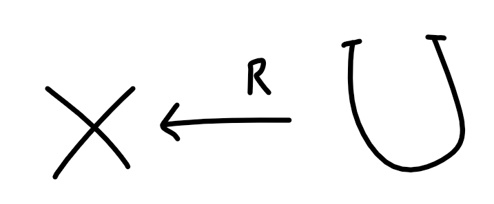

# 확률

안전한 암호의 요구사항을 설명할 때 알아야 하는 개념들임

중/고등학교 확률과 통계 내용에서 크게 안 벗어남. 강좌에서 설명하는 범주 내에서는 굉장히 간단한 개념만 사용.

이미 알만한 내용 제외. 표기법 정도만 작성할 예정

## Terminology

- `U` : universe. every event. finite set.
- `Pr[ Event ]` → Event가 일어날 확률
- Uniform distribution
    - for every x ∈ U Pr[x] = 1 / |U| 
    - 표기법은 다음고 같다

- Deterministic Algorithm
    - Returns always the same result with given arg
    - y ← f(x)
- Randomized Algorithm
    - have a implicit randomized algorithm
        - randomized = union distributed
    - so, output should also be a random variable.    