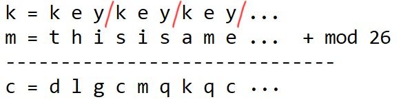

# 암호학

암호는 어디에나 있다!
- secure commnuication -> HTTPS, WPA2,...
- file encryption -> TrueCrypt,...
- User authentication
- 등등..

## Crypto Core 

### key establishment 
- key 생성 및 교환
- 여러 신박한 방법들이 있음

### Secure Communication
- 안전한 통신

지금으로써는 둘 다 굉장히 포괄적이고 모호한 느낌임

그러나 앞으로 공부해 갈수록 Secure Cipher에 대한 구체적인 요구사항을 알게 될 것임!

## 암/복호화 방법

### symmetric key  (대칭키 암호)
- 암/복호화 할 때 같은 key를 사용함

### Public key  (공개키 암호)
- 암/복호화 할 때 각각 다른 키를 사용하는 방법.

## 응용
- Digital Signature (전자서명)
- Anonymous commnunication (익명 대화)
- 가상화폐
- 프로토콜
    - 투표
    - 비밀 경매
- 등등

## 기타 등등..

### 암/복호화 알고리즘의 공개

- 실제 field 에서 사용되는 암호 알고리즘은 공개된 알고리즘임

- black box지만 위험할 가능성이 있는 알고리즘보다, 검증된 공개 알고리즘을 사용하는게 더 안전하다 생각하기 때문!

### Cryptography is NOT..
- 모든 security problem들의 해결책
- 적절하게 구현/응용하지 않아도 되는
- 스스로 새롭게 만들어 볼 만한
    - 공부 차원에서는 몰라도, 실제 서비스 등에 사용될 알고리즘은 검증된 표준(AES 등)을 쓰는게 안전

## 역사

### Substitution Cipher

key를 각 문자에 대한 치환 table로 정의

- Caesar Cipher : abcde...xyz -> defg...xyzabc
    - shift cipher

- Vigener Cipher
    - a부터 z까지 1,2,...,26이라 생각
    - Message + key mod 26
    - key 는 message length 에 맞춰 반복

- Rotor Machines
    - 글자 하나 치환할 때마다 mapping table 전체를 shift시킴.
    - Rotor를 여러개 사용하는 방법도 있음
    - enigm가 이에 해당!

### break it

- Caesar - frequency attack
    - 영어 문장에서 사용되는 알파벳의 분포는 uniform 하지 않음.
    - 암호문에 사용된 알파벳의 빈도를 통해 평문 획득 가능
    - CipherText only attack!

- Vigener - also frequency attack
    - key length를 알 때
        - key length가 `L` , 상수 `k`, `L`보다 작은 양수 `r`
        - `L * k + r` 위치에 있는 문자는 같은 문자로 암호화된 부분이다.
        - 이 부분들끼리 알파벳 빈도 공격으로 평문 복구 가능
    - 모를 때
        - Key len을 1,2,3,.. brute forcing 해가며 나온 빈도 공격 결과가 그럴싸한 문장이 될 때까지 시도
    - CipherText only attack!

- Rotor Machines
    - 다양한 공격 존재
    - 자세한 설명은 알아서

