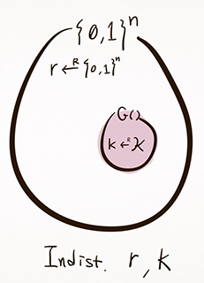
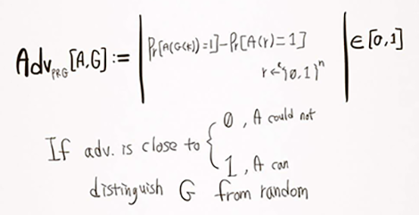

# PRG Security

## PRG Security Definition 1

Indistinguishable from Random



이렇듯, Pseudo random은 모든 n-bit string을 포함하지 않는다.

real random과 구분 불가능하다는 것을 어떻게 판단할까?

### statistical Tests on {0,1}^n

일단은 알고리즘 `A(x)`를 정의한다
- if x is random -> ouput 1
- if x is not random -> output 0

저렇게 판단할 수 있는 "effecient"한 알고리즘으로는
- binary string의 0과 1의 개수를 보고 판단한다
- '00'의 출현 빈도를 보고 판단한다
- 기타 등등..

### Evaluating Statistical Test is good or not : Advantage

Let...
```
G : k -> {0,1}^n        # PRG
A is a statatistical test on {0,1}^n
```
then evaluating such A..



살짝 궁금한점은 PRG를 random에서 구분 가능하다는 가정으로 eval한다는 것..

그럼 indistinguishable한 PRG를 대상으로 test하면 advantage가 0이 된다는 것인가?

사실 이걸로 statistical test를 eval한다기엔 G에 의해 결정되는게 많은듯.

---------

so..

### Secure PRG def.1

Let `G` be a PRG
```
G : k → {0,1}^n
```
Efficient한 statistical test `A`에 대해

Adv[A,G] 가 negligible (close to 0) 할 때 `G`가 secure 한 PRG라 함.

근데 그렇다고 임의의 `G`를 가져다가 `A`로 검증할 수 있을까?
- nope. P-NP 문제임 ㅋㅋ

## PRG security Definition 2

Predictable PRG → PRG is insecure!

주어진 PRG output으로 다음 output을 예측할 수 없다면

PRG의 주어진 output bit로 다음 bit을 예측할 확률이 ½ + ε 일 때

`ε` 가 1/1000보다 작아야(negligible 해야) unpredictable 하다 할 수 있다.

### Secure PRG def.2

Thm (Yoo '82)


Let `G` be a PRG
```
G : k → {0,1}^n
```
If ∀i ∈ {0,...,n-1}, PRG G is unpredictable at position i, then `G` is a secure PRG

근데 심지어 나중의 output으로 이후의 output을 predict 할 수 있는 경우에도 안전하지 않다고 한다! ㅋㅋ

아예 아무런 관계도 없어야 하는 것인가..

### More Generally..


이런 경우, 저 두 set P1, P2는 computationally indistinguishable 하다고 한다.

## Secure PRG to Secure Stream Cipher

일단 semantic secure에 대해 알아야 될거 같음.

이 강좌에서는 하나의 game을 통해 이를 검증.


Semantic security game이다.

> E is semantically secure if for all "eff" Adversary's advantage is negligible.

OTP도 message length가 같은 서로다른 두 메세지가 있을 때,

random하게 선택된 key에 의해 identical하게 distribute 되므로 sem. sec. 하다.

### Secure PRG -> z Stream Cipher

> stream ciper derived from secure PRG is semantically secure.

∀ sem. sec. adversary A, ∃a PRG adversary B s.t.

```
Adv[A,E] ≤ 2 × Adv[B,G]
```

왤까? 추가예정.